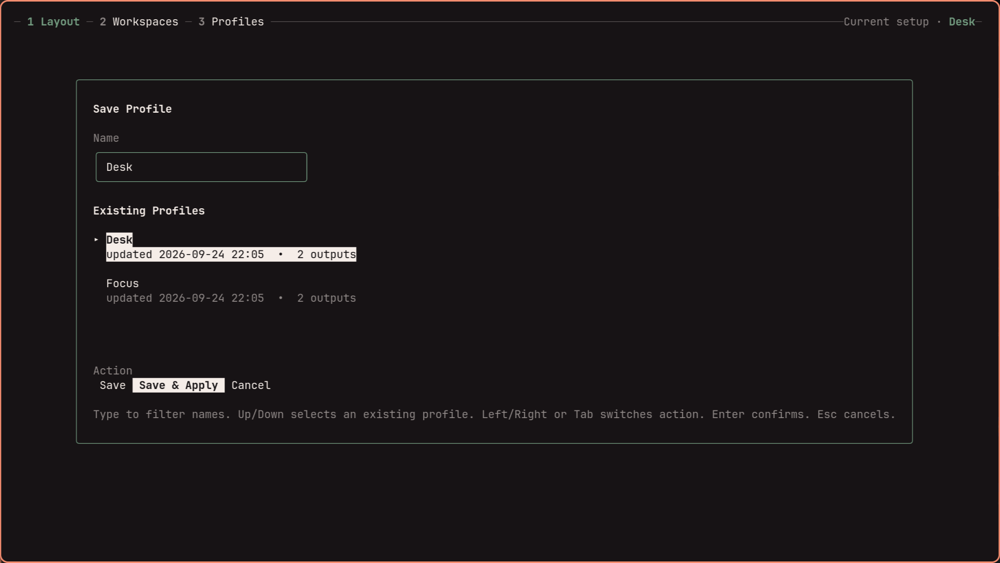

<div align="center">

<picture>
  <source media="(prefers-color-scheme: dark)" srcset="docs/assets/images/logotype_dark.svg">
  
</picture>

<strong>Create multi-monitor layouts for Hyprland.</strong><br>
Arrange visually. Save each setup. Switch automatically on hotplug and lid events.

Version 1.19 aligns display summaries and profile-command wording
with the Omarchy panel. See the [TUI guide](docs/_guide/tui.md) for hardware details
and the [shared design](DESIGN.md) for accepted presentation conventions and scope.

[](https://github.com/crmne/hyprmoncfg/releases)
[](https://aur.archlinux.org/packages/hyprmoncfg)
[](https://github.com/crmne/hyprmoncfg/actions/workflows/ci.yml)
[](https://opensource.org/licenses/MIT)

<a href="https://terminaltrove.com/hyprmoncfg/">
  <picture>
    <source media="(prefers-color-scheme: dark)" srcset="docs/assets/images/terminal-trove-tool-of-the-week-dark.svg">
    <source media="(prefers-color-scheme: light)" srcset="docs/assets/images/terminal-trove-tool-of-the-week-light.svg">
    
  </picture>
</a>

</div>

Version 1.19 adds independent failed-apply retries, per-output health,
bounded display discovery, visible small-terminal footer actions, workspace
persistence choices in both editors, and opt-in `hyprmoncfgd --power-aware-refresh`
for internal laptop panels. See the [release notes](docs/releases/1.19.0.md) and
daemon guide for highlights, limits, and defaults.

---

hyprmoncfg is a visual multi-monitor layout editor and automatic profile switcher for Hyprland. Drag displays into place, save each setup as a hardware-aware profile, and let the daemon apply the right one when monitors or your laptop lid change.


Actual TUI capture with synthetic display/profile data. See the
[screenshot gallery](https://hyprmoncfg.dev/what-is-hyprmoncfg/#screenshots) for
both themes, workspace planning, and profiles.

## What you get

- **Spatial layout editor** -- drag monitors on a canvas and tune mode, scale, VRR, mirror, transform, and exact position
- **Visible off displays** -- select a separate Off row and enable it in the draft; preview before changing the live layout
- **Named profiles** -- save setups like `desk`, `conference`, or `home-office`
- **Explicit layout reuse through editor IPC** -- map a saved layout onto currently connected displays, review the draft, then preview and save it as a new setup
- **Hardware-identity matching** -- profiles follow monitor make, model, and serial instead of unstable connector names
- **Hotplug and lid-aware daemon** -- apply the right profile automatically when monitors change or the laptop lid closes
- **Workspace planner** -- assign workspaces across monitors with sequential, interleave, or manual strategies
- **Safe apply with revert** -- reload Hyprland, verify the result, and revert unless you confirm
- **One-writer IPC** -- when the daemon is running, the TUI, CLI, and desktop panels send changes through it instead of racing over config files
- **Include-chain verification** -- refuse to write generated monitor config that Hyprland is not reading
- **Hyprland 0.55 Lua config support** -- write Lua automatically when `hyprland.lua` is active, while preserving legacy `.conf` setups
- **One hard runtime dependency** -- Hyprland; UPower is optional for immediate lid events

## Install

Arch Linux:

```bash
yay -S hyprmoncfg-bin
# or
yay -S hyprmoncfg-git
```

Fedora COPR:

```bash
sudo dnf copr enable paolino/hyprmoncfg
sudo dnf install hyprmoncfg
```

Nix / NixOS:

```bash
nix run nixpkgs#hyprmoncfg
nix profile install nixpkgs#hyprmoncfg
```

Gentoo GURU:

```bash
sudo eselect repository enable guru
sudo emaint sync -r guru
sudo emerge gui-apps/hyprmoncfg
```

Void Linux, via the unofficial [Blackhole-vl](https://github.com/Event-Horizon-VL/blackhole-vl) repo:

```bash
printf 'repository=https://mirror.black-hole.dev/%s/\n' "$(uname -m)" | sudo tee /etc/xbps.d/00-repository-blackhole.conf
sudo xbps-install -S
sudo xbps-install -S hyprland hyprmoncfg
```

Build from source:

```bash
git clone https://github.com/crmne/hyprmoncfg.git
cd hyprmoncfg
go build -o bin/hyprmoncfg  ./cmd/hyprmoncfg
go build -o bin/hyprmoncfgd ./cmd/hyprmoncfgd
install -Dm755 bin/hyprmoncfg  ~/.local/bin/hyprmoncfg
install -Dm755 bin/hyprmoncfgd ~/.local/bin/hyprmoncfgd
```

[`native-packages.yaml`](native-packages.yaml) declares binary packages, AUR
recipes, and downstream repositories; native recipes live in [`packaging/`](packaging/).
Install the shared CLI with `gem install native-packages --version 0.7.0`, build
packages and AUR recipes with `native-packages build --release v<version>`, and track
destinations with `native-packages status`. The other distributions' source recipes use
`ruby scripts/package_sources.rb prepare <version>`.
See [PACKAGING.md](PACKAGING.md) for staging, publishing, and release automation.

## Configure Hyprland

hyprmoncfg writes `~/.config/hypr/hyprmoncfg-monitors.lua` (or `.conf` on legacy configs), a file it creates and owns, and adds one line at the end of your root Hyprland config to load it. Loading last is what makes an applied layout final: any monitor rule read afterwards would override it. Your own `monitors.conf` or `monitors.lua` is never replaced. Run `hyprmoncfg doctor` to check the load order at any time.

## Create your first profile

```bash
hyprmoncfg
```

Drag monitors into place, press `s`, type a profile name like `desk`, and press `Enter`.

Apply it later from the CLI:

```bash
hyprmoncfg apply desk
```

## Enable automatic switching

AUR, Fedora COPR, Nixpkgs, and Gentoo GURU:

```bash
systemctl --user daemon-reload
systemctl --user enable --now hyprmoncfgd
```

Void Linux with Blackhole-vl:

```text
exec-once = hyprmoncfgd
```

Manual install:

```bash
mkdir -p ~/.config/systemd/user
cp packaging/systemd/hyprmoncfgd.local.service ~/.config/systemd/user/hyprmoncfgd.service
systemctl --user daemon-reload
systemctl --user enable --now hyprmoncfgd
```

The daemon scores profiles in `~/.config/hyprmoncfg/profiles/` against the connected displays. A partial match can provide the base for a temporary extended layout without changing the saved profile. Unfamiliar displays are added unless the profile explicitly sets `disable_unknown_outputs: true`; deliberately disabled known displays remain off. Missing saved displays are allowed for undocking. Delete throwaway profiles before relying on automatic switching.

When a dock is still connecting, monitor and workspace reads have short deadlines and desktop clients can show a connecting state while retrying. Unique hardware identities skip DRM connector probing; ambiguous identities use one shared probe with bounded waiting. See [daemon behavior](https://hyprmoncfg.dev/daemon/) and the [editor IPC reference](https://hyprmoncfg.dev/ipc/) for the matching and draft-reuse contracts.

Newly connected displays extend the matching layout to the right, touching its rightmost display. Automatically extended layouts appear as unsaved drafts in the editor and panel; save one to name and reuse it. Workspace planning follows the profile's settings, or defaults to sequential groups of three across nine workspaces when planning was disabled. In the TUI, press `U` to toggle disabling displays outside the profile, then save. The corresponding profile JSON setting is `disable_unknown_outputs` (default `false`). Displays explicitly saved as disabled stay disabled.

On Omarchy versions that launch `omarchy-hyprland-monitor-watch`, `hyprmoncfgd` stops that exact transient user scope while it owns monitor profiles and restores the watcher when the daemon exits during a live Hyprland session. Generated configuration used without the daemon cannot provide this runtime ownership; static-config users must disable the Omarchy watcher separately.

Omarchy's lock/wake script reads `~/.config/hypr/monitors.lua` directly, before its remembered scale. To prevent it from resetting the laptop's scale and position, hyprmoncfg keeps a marked, connector-specific wake rule at the top of that file, alongside Omarchy's remembered scale. Your existing rules and defaults stay intact. Canceling a preview restores the previous wake settings; turning management off removes the marked block. Read-only dotfiles are left alone with a diagnostic. Omarchy still controls lid recovery and uses its preferred mode when re-enabling an entirely disabled panel; hyprmoncfg then restores the full profile.

When the daemon is running, it is the canonical monitor-config writer. The TUI, CLI, and desktop integrations use its versioned Unix-socket IPC; when it is absent, the TUI and CLI keep working through the same core engine in direct mode. A profile selected interactively stays selected until the next monitor hotplug or lid change, when automatic matching resumes.

## Omarchy Quattro panel

On Omarchy Quattro, [hyprmoncfg: Multi-Monitor Manager for Omarchy](https://omarchyplugins.com/plugin.html?id=crmne.hyprmoncfg) lets you create multi-monitor layouts for Hyprland in a visual editor and switch them automatically on hotplug and lid events. The panel shows your live layout and active profile right in the bar:


Get it from the [Omarchy Plugins marketplace](https://omarchyplugins.com/plugin.html?id=crmne.hyprmoncfg), or install it directly:

```bash
omarchy plugin add https://github.com/crmne/omarchy-hyprmoncfg.git --enable
```

If hyprmoncfg is not installed yet, open the panel and choose **Install hyprmoncfg**. It installs the stable AUR package, starts the daemon, and opens the layout editor so you can arrange and save your first profile. See the [Omarchy Quattro panel guide](https://hyprmoncfg.dev/omarchy/) for the full workflow.

## Screenshots

hyprmoncfg adapts to your theme. Here are some examples:

| Layout editor | Save dialog |
| --- | --- |
|  |  |

## Why it exists

Configuring monitors in Hyprland means writing `monitor=` lines by hand. A 4K display at 1.33333x scale is effectively 2880x1620 pixels, so the monitor next to it needs to start at x=2880. Vertically centering a 1080p panel against it means doing division in your head, reloading, noticing the layout is wrong, and editing again.

It gets worse when setups change:

- **No visual editor.** You write `monitor=` lines by hand and hope the coordinates are right.
- **No profiles.** Desk, projector, travel, and docked setups all need different layouts.
- **No automatic switching.** Hotplug a monitor and Hyprland guesses again.
- **Connector names are unstable.** `DP-1` and `DP-2` can swap between boots.
- **Some tools pull in too much.** Python, GTK, and GObject introspection are a lot of stack just to move a rectangle.

## How it works

hyprmoncfg ships two binaries:

| | |
|---|---|
| `hyprmoncfg` | TUI + CLI for layout editing, profile management, and workspace planning |
| `hyprmoncfgd` | Background daemon that auto-applies the best matching profile on hotplug and lid changes |

Both use the same apply engine:

```bash
write monitors.conf -> reload Hyprland -> verify live state -> confirm or revert
```

There is no separate best-effort daemon path. If the TUI can apply a profile correctly, the daemon uses the same machinery.

## Dotfiles integration

Profiles live in `~/.config/hyprmoncfg/profiles/`. Each profile has a canonical JSON file plus generated `.conf` and `.lua` sidecars you can keep as plain Hyprland snippets if you stop using hyprmoncfg. Add the directory to your dotfile manager and your layouts roam across every machine you own.

With [chezmoi](https://www.chezmoi.io/):

```bash
chezmoi add ~/.config/hyprmoncfg
```

Now your desk at home, your laptop on the road, and your Raspberry Pi in the closet all share the same profile library. The daemon picks the right one based on what's actually plugged in.

You don't commit the generated `~/.config/hypr/hyprmoncfg-monitors.{conf,lua}`. You commit your profiles. The tool writes the generated monitor config for you.

## How it compares

| | hyprmoncfg | Monique | HyprDynamicMonitors | HyprMon | nwg-displays | kanshi |
|---|---|---|---|---|---|---|
| GUI or TUI | TUI | GUI | TUI | TUI | GUI | CLI |
| Spatial layout editor | Yes | Yes | Partial | Yes | Yes | No |
| Drag-and-drop | Yes | Yes | No | Yes | Yes | No |
| Snapping | Yes | Not documented | No | Yes | Yes | No |
| Profiles | Yes | Yes | Yes | Yes | No | Yes |
| Auto-switching daemon | Yes | Yes | Yes | No (roadmap) | No | Yes |
| Workspace planning | Yes | Yes | No | No | Basic | No |
| Mirror support | Yes | Yes | Yes | Yes | Yes | No |
| Safe apply with revert | Yes | Yes | No | Partial (manual rollback) | No | No |
| Hyprland 0.55 Lua config | Yes | No | No | No | Yes | N/A |
| Include-chain verification | Yes | No | No | No | No | No |
| Additional runtime dependencies | None | Python + GTK4 + libadwaita | UPower, D-Bus | None | Python + GTK3 | None |

## Docs

Full documentation at **[hyprmoncfg.dev](https://hyprmoncfg.dev)**.

## Development

Read [DESIGN.md](DESIGN.md) for the proposed shared daemon, TUI, and Omarchy-panel
direction and the [dated baseline review](docs/design-review-2026-09-22.md) for
release evidence and outstanding work. Proposed capabilities are not shipped features.

Install the pre-commit hook to run CI checks locally before each commit:

```bash
ln -sf "$(pwd)/scripts/pre-commit" .git/hooks/pre-commit
```

The hook runs `go mod tidy`, `go vet`, `go test`, and `go build`.

Regenerate demo videos and screenshots:

```bash
./scripts/capture_media.sh
```

The media scripts use the installed `hyprmoncfg` from `PATH`.

Regenerate only the GIF and MP4 demo:

```bash
./scripts/capture_demo.sh
```

Regenerate only screenshots:

```bash
./scripts/capture_screenshots.sh
```

## License

MIT
